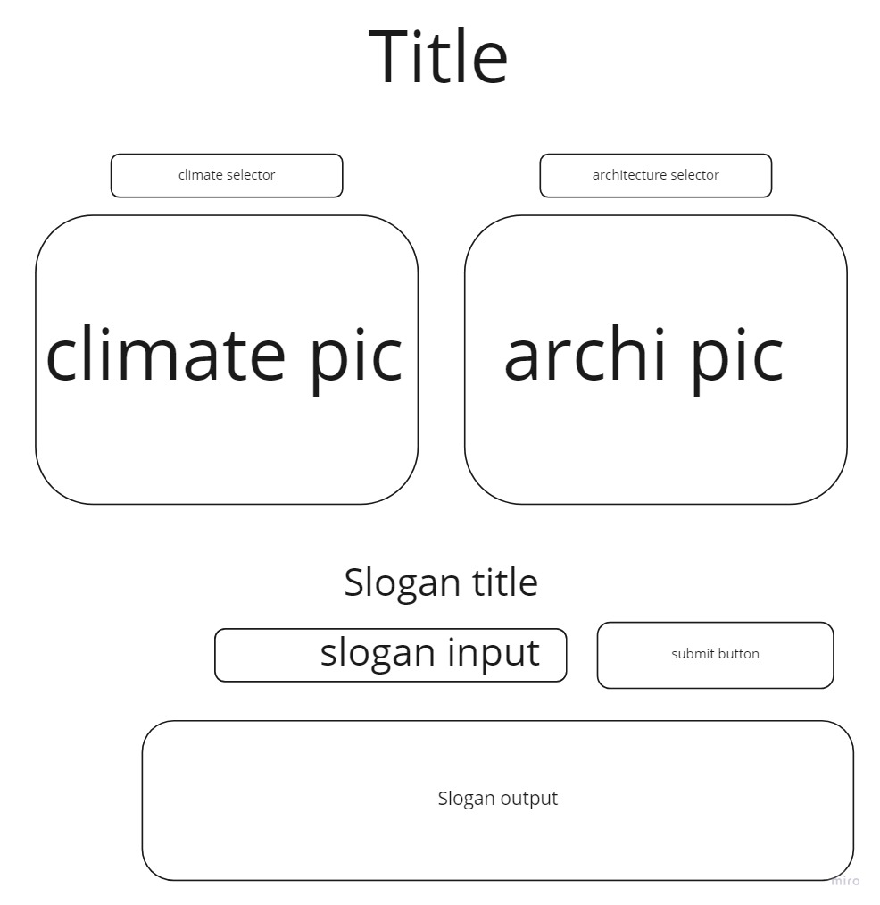

## The Golden Rule: 

🦸 🦸‍♂️ `Stop starting and start finishing.` 🏁

If you work on more than one feature at a time, you are guaranteed to multiply your bugs and your anxiety.

## Making a plan

1) **Make a drawing of your app. Simple "wireframes"** 

1) **Look at the drawing and name the HTML elements you'll need to realize your vision**
title div
climate dropdown
architecture dropdown
climate pic div
archi pic div
slogan title div
slogan input
submit button
slogan output div

1) **Look at the drawing and imagine using the app. What _state_ do you need to track?** 
climate selection
architecture selection
slogan input
slogan output
climate change count
architecture change count

1) **For each HTML element ask: Why do I need this? (i.e., "we need div to display the results in")** 
display title
select climate
select architecture
display climate
display archi
display slogan title
user input for slogan
submit slogan
display slogan and climate/archi change counts

1) **Once we know _why_ we need each element, think about how to implement the "Why" as a "How" (i.e., `resultsEl.textContent = newResults`)**
<h1>Title</h1>
<select>Climate<option value="option1">Option 1</option></select>
<select>Architecture<option value="option1">Option 1</option></select>

  js: eventlistener('change'): backgroundImage = ${option}.png

  js: eventlistener('change'): backgroundImage = ${option}.png
<h2>City Slogans</h2>
<input id="sloganInput"></input>
<button id="submitButton">Submit</button>
.createElement('ul')  .append(li)

1) **Find all the 'events' (user clicks, form submit, on load etc) in your app. Ask one by one, "What happens when" for each of these events. Does any state change? Does any DOM update?**
selecting a climate changes the climate pic and adds to the climate change count
selecting an architecture changes the archi pic and adds to the archi change count
clicking the button updates the city slogans list and displays it

1) **Think about how to validate each of your features according to a Definition of Done. (Hint: console.log usually helps here.)**

1) **Consider what features _depend_ on what other features. Use this dependency logic to figure out what order to complete tasks.**

Additional considerations:
- Ask: which of your HTML elements need to be hard coded, and which need to be dynamically generated?
- Consider your data model. 
  - What kinds of objects (i.e., Dogs, Friends, Todos, etc) will you need? 
  - What are the key/value pairs? 
  - What arrays might you need? 
  - What needs to live in a persistence layer?
- Is there some state we need to initialize?
- Ask: should any of this work be abstracted into functions? (i.e., is the work complicated? can it be resused?)
